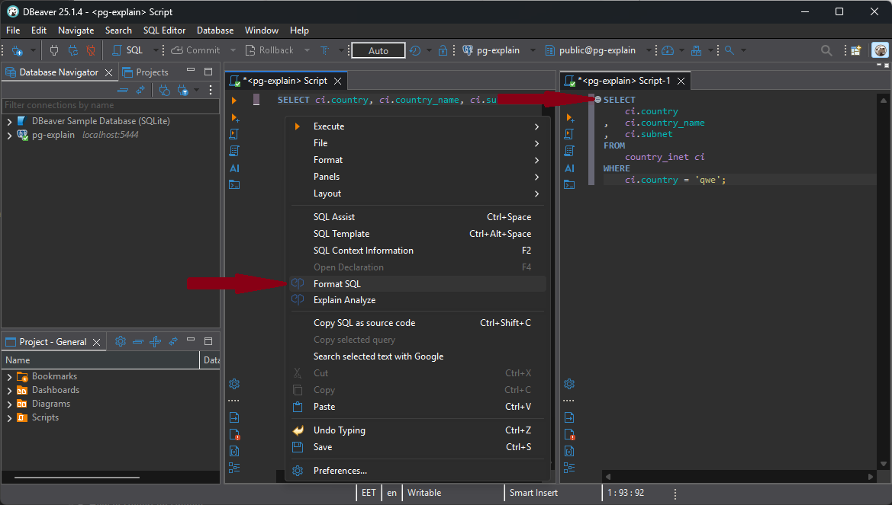
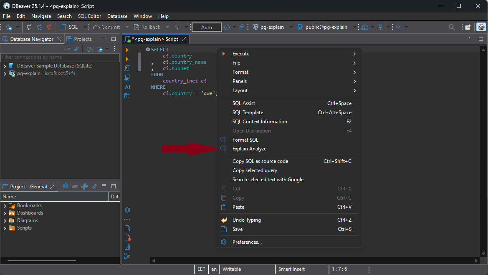
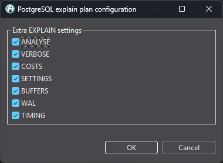
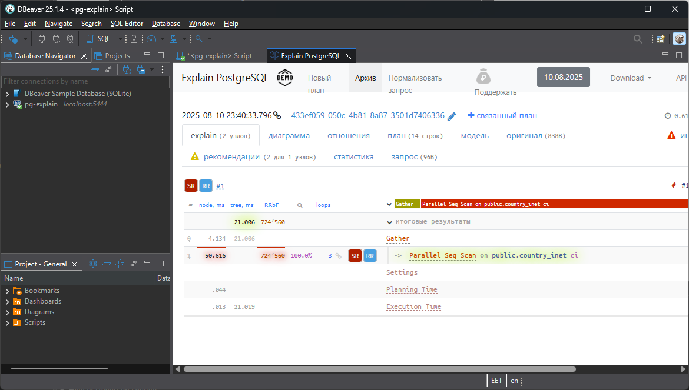
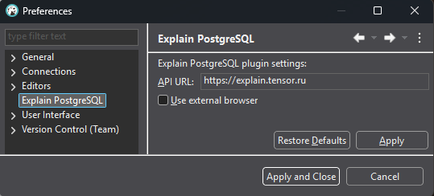
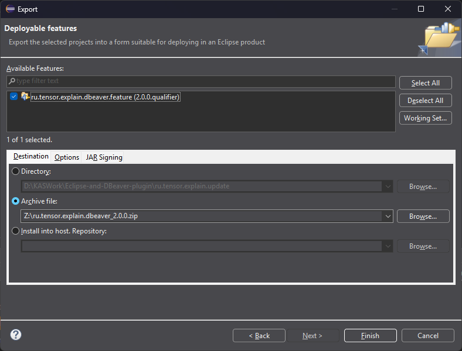
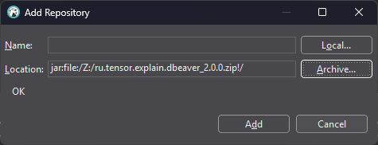
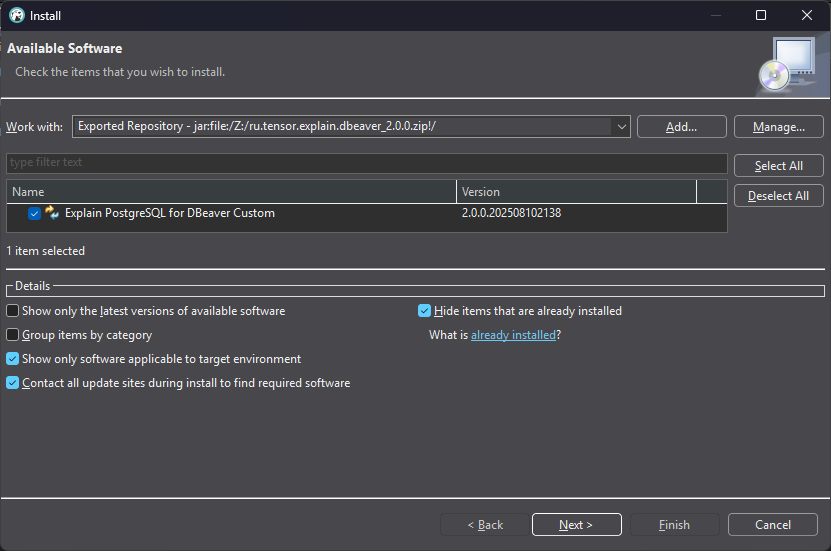

# Explain PostgreSQL plugin for DBeaver

Analyzes EXPLAIN plan from PostgreSQL and related (Greenplum, Citus, TimescaleDB and Amazon RedShift).
  
Shows plan and node details and visualizations with piechart, flowchart and tilemap, also gives smart recommendations to improve query.

Uses the public api from the <a href="https://explain.tensor.ru">explain.tensor.ru</a>, the site can be changed in Preferences.

<a href="https://explain.tensor.ru/about">Learn more</a>
  
<h3>Usage DBeaver</h3>
<ul>
    <li>Format query</li>
    <ul>
        <li>
			 Select "Format SQL" from the context menu of the SQL editor.
		</li>
        
    </ul>
    <li>Explain plan</li>
    <ul>
        <li>
			Select "Explain Analyze" from the context menu of the SQL editor.
		</li>
        
        <li>
			Choose explain plan configuration.
		</li>
        
        <li>
			Review explain of query.
		</li>
        
    </ul>
    <li>Preferences</li>
    <ul>
        <li>
			Choose Window -> Preferences -> Select "Explain PostgreSQL".
		</li>
        
    </ul>
</ul>
 
<h3>Install</h3>
<ul>
	<li>From official repository</li>
		<ul>
			<li>
				From the Eclipse menu, choose Help -> Install new software and enter the URL:
				 <code>https://explain.tensor.ru/downloads/plugins/eclipse/</code>
			</li>
		</ul>
	<li>From manual built archive</li>	
    <ul>
        <li>
			Get <a href="https://www.eclipse.org/downloads/packages/release/2025-06/r/eclipse-ide-rcp-and-rap-developers">Eclipse IDE for RCP and RAP Developers</a>.
		</li>
        <li>
			Open project from source code by Eclipse IDE.
		</li>
        <li>
			Export feature, choose File -> Export -> Deployable features to Archive file.
		</li>
		
        <li>
			In DBeaver add archive file as source, choose Help -> Install New Software... -> Add... -> Archive... and select archive file.
		</li>
		
        <li>
			Install plugin from archive file.
		</li>
		
    </ul>
</ul>
 

<a href="https://n.sbis.ru/explain">Support</a>
